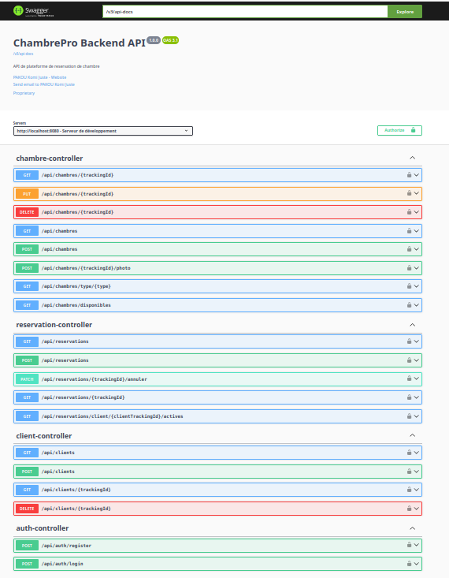

# ChambrePro Backend API

This is the backend API for ChambrePro, a platform for booking rooms. It is built with Spring Boot and provides a RESTful API for managing rooms, bookings, and users.

## Table of Contents

- [About The Project](#about-the-project)
- [Built With](#built-with)
- [Getting Started](#getting-started)
  - [Prerequisites](#prerequisites)
  - [Installation](#installation)
- [Usage](#usage)
- [API Documentation](#api-documentation)
- [License](#license)
- [Contact](#contact)

## About The Project

ChambrePro is a comprehensive room booking platform that allows users to search for, book, and manage room reservations. This backend API provides all the necessary endpoints to support the frontend application.

## Built With

* [Spring Boot](https://spring.io/projects/spring-boot)
* [Spring Security](https://spring.io/projects/spring-security)
* [Spring Data JPA](https://spring.io/projects/spring-data-jpa)
* [PostgreSQL](https://www.postgresql.org/)
* [MinIO](https://min.io/)
* [Flyway](https://flywaydb.org/)
* [MapStruct](https://mapstruct.org/)
* [JWT](https://jwt.io/)
* [Swagger (OpenAPI)](https://swagger.io/)

## Getting Started

To get a local copy up and running follow these simple steps.

### Prerequisites

* Java 17
* Docker
* Docker Compose

### Installation

1. Clone the repo
   ```sh
   git clone https://github.com/Juste120/ChambrePro.git
   ```
2. Navigate to the project directory
   ```sh
   cd ChambrePro
   ```
3. Start the database and MinIO services using Docker Compose
   ```sh
   docker-compose up -d
   ```
4. Run the application
   ```sh
   ./gradlew bootRun
   ```

## Usage

The API will be available at `http://localhost:8080`. You can use a tool like Postman or the Swagger UI to interact with the API.

## API Documentation

The API documentation is available through Swagger UI at `http://localhost:8080/swagger-ui.html`.



## License

Distributed under the MIT License. See `LICENSE` for more information.

## Contact

PAKOU Komi Juste - [@pakoujuste](https://twitter.com/pakoujuste) - pakoujuste2019@gmail.com

Project Link: [https://github.com/Juste120/ChambrePro](https://github.com/Juste120/ChambrePro)
